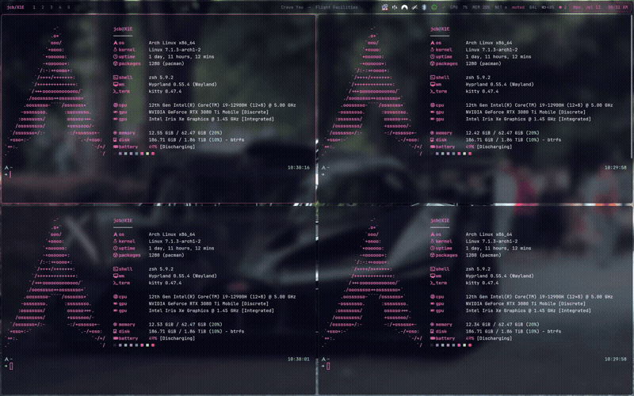

<h1 align="center">
   hyprstatus
</h1>

<p align="center">
  A status bar that lives <em>inside</em> the compositor — a Hyprland plugin that
  replaces Waybar with a bar rendered by Hyprland itself.
</p>

> [!WARNING]
> This software is 99% vibe coded with Claude Fable 5, however it has been externally reviewed.
> Use at your own discretion.

## Demo



> Animated preview — [full-quality video](assets/hyprstatus-demo.mp4).

## Why not just Waybar?

| | Waybar | hyprstatus |
|---|---|---|
| process | separate GTK client | inside Hyprland |
| hyprland state (workspaces, titles, submaps) | polled/streamed over IPC sockets | read directly from compositor memory, updated by compositor events the same frame |
| config | JSONC + GTK CSS, own reload | `hyprland.conf` (`plugin:hyprstatus:*`), atomically re-themed by `hyprctl reload` |
| rendering | GTK, own damage | Hyprland's GL render pass + damage tracking — costs nothing while nothing changes; native blur |
| clicks | layer-shell surface | consumed pre-keybind by the compositor; workspace clicks call dispatchers directly |
| control | signals / waybar-msg | `hyprctl dispatch hyprstatus:toggle`, `hyprstatus:refresh [module]`, `hyprctl hyprstatus` (JSON state) |

## Install

```sh
hyprpm add https://github.com/Tecknich/hyprstatus   # or a local repo path
hyprpm enable hyprstatus
hyprpm reload
```

Add `exec-once = hyprpm reload -n` to `hyprland.conf` so it loads on start.
Build deps beyond Hyprland headers: `pangocairo`, `libpulse`, `libsystemd`
(sd-bus), `librsvg`, `cairo` — all present on any Arch/Hyprland box.

For development: `cmake -B build -S . && cmake --build build` then
`hyprctl plugin load "$PWD/build/hyprstatus.so"` (absolute path required).

## Configure

Everything lives in `hyprland.conf`. See [`example/hyprstatus.conf`](example/hyprstatus.conf)
for a full setup (floating themed bar, custom script modules, tray).

```ini
plugin {
    hyprstatus {
        height = 38
        margin = 4
        rounding = 6
        font_family = JetBrainsMono Nerd Font
        font_size = 13
        modules_left = workspaces window
        modules_center = clock
        modules_right = tray network pulseaudio battery
        col.background = rgba(06051aa6)
        col.accent = rgba(ff6ec7ff)
        # col.foreground, col.border, col.ok, col.warn, col.err, ...
    }
}
```

Per-module options use Waybar's option names, one per line, commas in values
allowed (only the first two commas split):

```ini
hyprstatus-set = clock, format, %a, %b %d   %I:%M %p
hyprstatus-set = battery, states.warning, 20
hyprstatus-set = network, on-click-right, pypr toggle nmtui
```

Custom script modules are Waybar-compatible (`return-type json` with
`{text, alt, tooltip, class, percentage}`, `exec-if`, `interval`, streaming
mode when `interval` is omitted, `signal N`, `max-length`, click/scroll
actions):

```ini
hyprstatus-module = nowplaying
hyprstatus-set = nowplaying, exec, ~/.config/scripts/nowplaying.sh
hyprstatus-set = nowplaying, return-type, json
hyprstatus-set = nowplaying, interval, 2
hyprstatus-set = nowplaying, on-click, playerctl play-pause
```

To refresh a module instantly from a script (Waybar's `pkill -RTMIN+N waybar`):
either `pkill -RTMIN+9 Hyprland` with `hyprstatus-set = mymod, signal, 9`, or
`hyprctl dispatch hyprstatus:refresh mymod`.

## Modules

`workspaces` (persistent lists, urgent/active states, click/scroll switching) ·
`window` · `clock` (colored waybar-style calendar tooltip; right-click for a
full-year view) · `cpu` (per-core tooltip) · `memory` · `temperature` ·
`battery` (instant AC plug/unplug via udev) · `network` ·
`pulseaudio` (PipeWire via pipewire-pulse) · `power-profiles` · `language` ·
`submap` · `tray` (StatusNotifierItem host + native DBusMenu popups) ·
`notifications` (SwayNotificationCenter) · custom exec modules.

Waybar option names (`format`, `format-icons.<key>`, `states.*`, `interval`,
`on-click*`, `tooltip-format*`, `max-length`, ...) work as you expect.

The `tray` module can filter items: `hide`/`hide-passive` drop items by
Id/Title or Passive status, and `hide-if-bt-disconnected = <item>=<device>`
hides an item unless a BlueZ device matching `<device>` is connected right now
(watched live over the system bus) — handy for apps like librepods that leave a
tray item behind, with stale battery, after the bluetooth device disconnects.

## Known limitations

- **Tray menus** render natively (DBusMenu popups) with per-item icons,
  submenus, separators, and checkboxes; nesting is limited to two levels.
- The bar auto-hides over fullscreen windows by default (`hide_on_fullscreen`).
- While a Hyprland config-error banner is visible it shares the reserved-area
  slot with the bar; layout normalizes as soon as the error is fixed.
- One bar; per-monitor different layouts not yet supported (`monitors = `
  restricts which outputs show the bar).

## Compatibility & support

Hyprland plugins are ABI-locked to the exact running compositor build and this
one leans heavily on Hyprland's internal API, so it must be built against the
version you run — always install via `hyprpm`, which does that for you.

hyprstatus currently tracks repo **HEAD**: `hyprpm add` / `hyprpm update` builds
the latest `main`, which targets the current Hyprland release. There are no
`commit_pins` yet — once Hyprland moves past the tested version below, a
`commit_pins` entry will pin that release to a known-good commit so existing
users keep working code while `main` moves on to the next API (open an issue with
your `hyprctl version` if a build breaks).

| Hyprland | hyprstatus | status |
|---|---|---|
| 0.55.4 | `main` (HEAD) | developed + tested against this |

CI ([`.github/workflows/build.yml`](.github/workflows/build.yml)) builds against
the Hyprland headers Arch ships, on every push/PR and weekly, so upstream API
drift surfaces as a red build rather than a broken install.

**Tested environment:** Arch Linux, single monitor, PipeWire (`pipewire-pulse`),
`power-profiles-daemon`, SwayNotificationCenter, and appindicator/SNI tray apps
(NetworkManager, blueman, NordVPN). Other distros, notification daemons, and
multi-monitor setups are expected to work but are less exercised — see **Known
limitations** above. Bug reports welcome.
